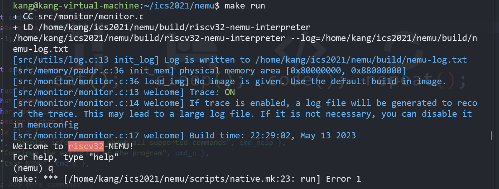
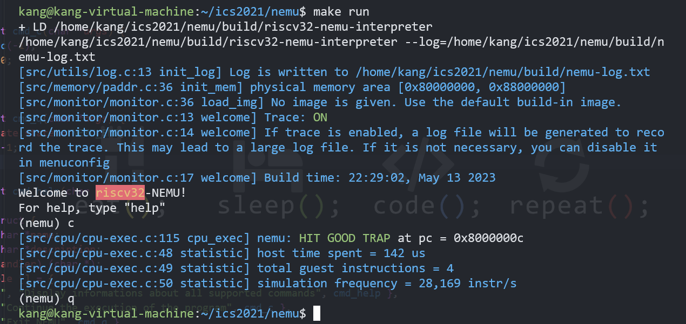

##  优美地退出程序

在执行  ` make run ` 命令后，程序开始编译运行，出现 `(nemu)` 字样的提示符。

在输入命令 `c` 后，CPU 开始运行，运行结束后会给出一些信息：

```bash
[src/cpu/cpu-exec.c:115 cpu_exec] nemu: HIT GOOD TRAP at pc = 0x8000000c
[src/cpu/cpu-exec.c:48 statistic] host time spent = 142 us
[src/cpu/cpu-exec.c:49 statistic] total guest instructions = 4
[src/cpu/cpu-exec.c:50 statistic] simulation frequency = 28,169 instr/s
```

接着在输入命令 `q` 后，直接退出程序，不会给出任何信息。


但是，在程序运行后不执行命令 `c` 而是直接输入命令 `q` ，退出程序，则会出现一条错误信息：

```bash
make: *** [/home/kang/ics2021/nemu/scripts/native.mk:23: run] Error 1
```

如下图所示：



通过阅读源代码，理解程序执行流程后发现，程序结束后的返回值由函数 `is_exit_status_bad()` 决定。

```C
int is_exit_status_bad() {
  int good = (nemu_state.state == NEMU_END && nemu_state.halt_ret == 0) ||
    (nemu_state.state == NEMU_QUIT);
  return !good;
}
```

函数 `is_exit_status_bad()` d 返回值又由结构体 `nemu_state` 决定。结构体 `nemu_state` 的初始化如下：

```C
NEMUState nemu_state = { .state = NEMU_STOP };
```

在直接输入命令 `q` 后，执行函数 `static int cmd_q(char **args*)` 。

```C
static int cmd_q(char *args) {
  return -1;
}
```

因此，`nemu_state.state` 的值并没有发生改变，仍然为 `NEMU_STOP` ，所以函数 `is_exit_status_bad()` 的返回值为 1 。出现 `Error 1` 提示。

修改 函数 `static int cmd_q(char **args*)` 为

```C
static int cmd_q(char *args) {
  nemu_state.state = NEMU_END; // 更新 nemu_state 状态
  return -1;
}
```

即可解决这个问题。



时间：2023/05/14